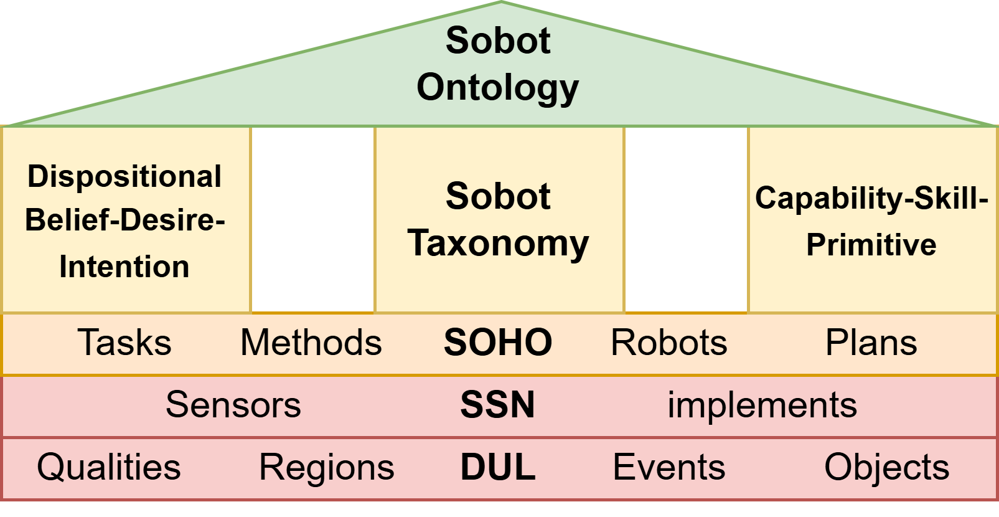

# Sobots

## A domain ontology for social robots

This repository contains an ontological model developed within the BFS research project [FORSocialRobots](https://www.forsocialrobots.de/). It features basic vocabulary for social human-robot interaction based on a taxonomy from prior research, combined with concepts for skill-based task processing and belief-desire-intention modelling.

- *Core/*         Contains the core ontology
- *Rules/*        Contains the rule files applied in Jena Fuseki
- *Instances/*    Contains instances of the meta-model, currently only an extended version of the [Sharework](https://github.com/pstlab/SOHO) use case *Capital Goods*.

Sobots uses DOLCE+DnS Ultralite, SSN and SOHO as domains for human-robot-interaction and aims to specialize within the sub-domain of social robotics.

## Application

We implemented a [digital twin prototype](https://github.com/Neroware/FSRDigitalTwin3D/) that leverages a semantic knowledge server based on Sobots combined with an interactive virtualization environment to run interactive processes of human-robot-interaction.

## Publications

Unfortunately, we do not have any publications out yet...

## References

1. A. Umbrico, A. Orlandini, and A. Cesta, “An ontology for human-robot collaboration,” Procedia CIRP, vol. 93, pp. 1097–1102, 2020. 53rd CIRP Conference on Manufacturing Systems 2020.
2. F. Toyoshima, A. Barton, and O. Grenier, “Foundations for an ontology of belief, desire and intention,” in 11th International Conference on Formal Ontology in Information Systems (FOIS 2020), pp. 140–154, IOS Press, Sep 2020.
3. S. Borgo, R. Ferrario, A. Gangemi, N. Guarino, C. Masolo, D. Porello, E. M. Sanfilippo, L. Vieu, S. Borgo, A. Galton, and O. Kutz, “Dolce: A descriptive ontology for linguistic and cognitive engineering,” Applied Ontology, vol. 17, no. 1, pp. 45–69, 2022.
4. M. Compton, P. Barnaghi, L. Bermudez, R. Garc´ıa-Castro, O. Corcho, S. Cox, J. Graybeal, M. Hauswirth, C. Henson, A. Herzog, V. Huang, K. Janowicz, W. D. Kelsey, D. Le Phuoc, L. Lefort, M. Leggieri, H. Neuhaus, A. Nikolov, K. Page, A. Passant, A. Sheth, and K. Taylor, “The ssn ontology of the w3c semantic sensor network incubator group,” Journal of Web Semantics, vol. 17, pp. 25–32, 2012.